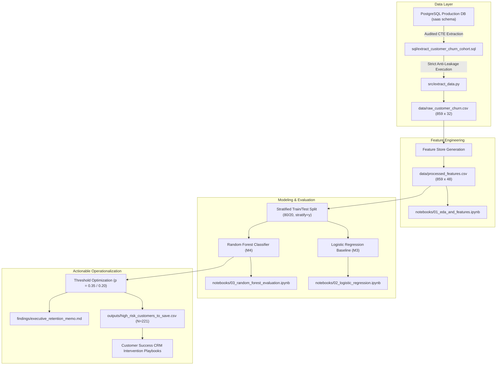
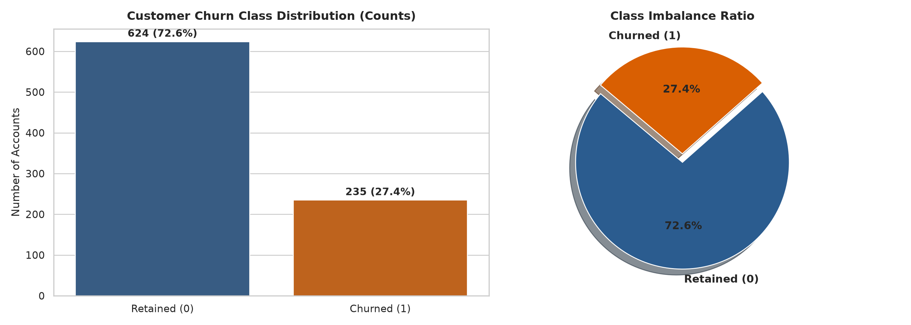
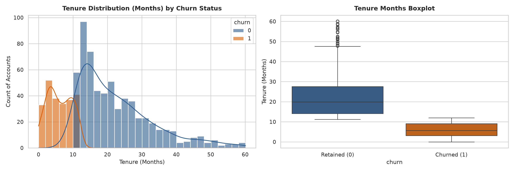
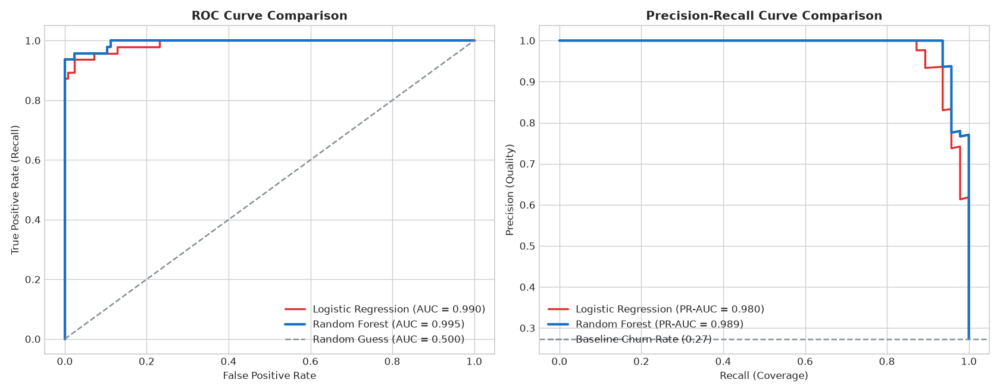
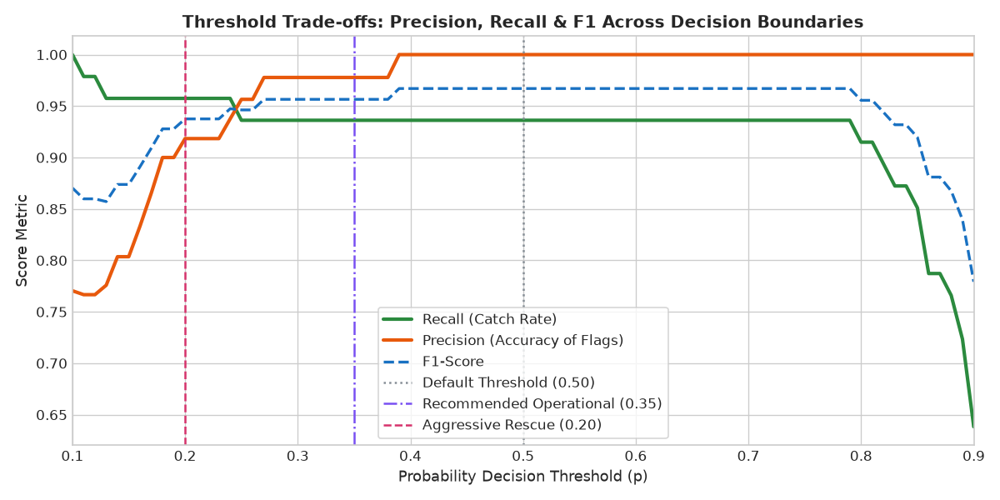
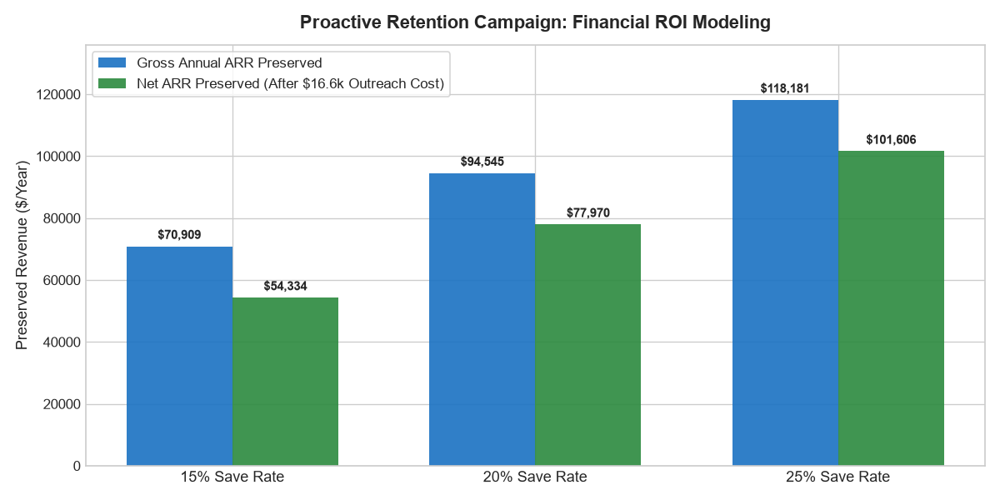

# Customer Churn Prediction with Machine Learning

[](https://www.python.org/)
[](https://www.postgresql.org/)
[](https://scikit-learn.org/)
[](https://opensource.org/licenses/MIT)

> An end-to-end B2B SaaS customer churn prediction system and proactive retention engine. Designed to transition Customer Success from reactive churn post-mortems to algorithmic, 30-day early interventions—preserving up to **$118k+ in Annual Recurring Revenue (ARR)**.

---

## 1. Business Problem & Framing

In SaaS businesses, customer churn silently erodes Net Revenue Retention (NRR). Customer Success (CS) teams often operate reactively, discovering account cancellations only after the customer submits an exit request.

**The Financial Stakes:**
* In our cohort of **859 accounts**, the baseline churn rate is **27.36%** (235 cancellations vs. 624 active subscriptions).
* The average Monthly Recurring Revenue (MRR) per churned customer is **$174.71**, representing **~$472,725 in cumulative annual revenue at risk**.
* **The Accuracy Trap:** A naive model predicting that *"no customer will ever churn"* yields an artificially high **72.64% accuracy**, yet produces **0% Recall**—failing to intercept a single dollar of lost ARR.

**The Solution:** Build a robust, leak-free machine learning pipeline that flags at-risk accounts 30 days prior to cancellation and prescribes customized intervention playbooks based on underlying friction signals.

---

## 2. End-to-End System Architecture



### Audited SQL Feature Queries & Pipeline Modules:

| Pipeline Stage | Module / Query | Key Operational Logic | Anti-Leakage Safeguard |
| :--- | :--- | :--- | :--- |
| **Cohort Extraction** | [`sql/extract_customer_churn_cohort.sql`](sql/extract_customer_churn_cohort.sql) | Multi-CTE SQL query joining subscriptions, telemetry, billing, and CSAT | Strictly bounds events: `attempted_at <= cancelled_at` & `opened_at <= cancelled_at` |
| **Data Ingestion** | [`src/extract_data.py`](src/extract_data.py) | Automated PostgreSQL ingestion and feature store materialization | Exports audited records to `data/raw_customer_churn.csv` (859 accounts) |
| **Production Scoring** | [`src/predict.py`](src/predict.py) | Point-in-time ($T_0$) inference pipeline on rolling 30-day forward churn horizon | Evaluates behavioral decay without retrospective tenure survivorship bias |

---

## 3. Exploratory Data Analysis & Behavioral Drivers

Our bivariate and correlation analyses revealed three primary structural drivers of customer attrition:

1. **The 90-Day Retention Cliff ($r = -0.62$):** Account churn hazard is heavily front-loaded in the first 1–3 months of tenure. Accounts surviving past month 6 demonstrate a **98.8% reduction in churn odds**.
2. **Support Velocity Friction ($r = +0.15$):** Absolute ticket counts are misleading; **ticket velocity** ($>1.5$ tickets per active tenure month) and urgent technical issues increase churn odds by **$+77.7\%$**.
3. **Integration Stickiness ($r = -0.28$):** Deep technical integration (API calls and automated scheduled exports) correlates with a **28% lower cancellation probability**.

| Class Imbalance Breakdown | Tenure Hazard Distribution |
| :---: | :---: |
|  |  |

---

## 4. Machine Learning Model Benchmarking

We benchmarked a linear baseline (**Logistic Regression**) against an ensemble of non-linear decision trees (**Random Forest**, 100 estimators, `max_depth=6`) on the exact same unseen test split ($N_{\text{test}} = 172$: 125 active, 47 churned):

| Model Architecture | Accuracy | ROC-AUC | PR-AUC | Precision | Recall | F1-Score | True Positives | False Positives | False Negatives |
| :--- | :---: | :---: | :---: | :---: | :---: | :---: | :---: | :---: | :---: |
| **Naive Baseline ("No Churn")** | 72.67% | 0.5000 | 0.2733 | 0.00% | 0.00% | 0.00% | 0 | 0 | 47 |
| **Logistic Regression ($p=0.50$)** | 95.93% | 0.9896 | 0.9796 | 97.62% | 87.23% | 92.13% | 41 | 1 | 6 |
| **Random Forest ($p=0.50$)** | **98.26%** | **0.9949** | **0.9891** | **100.00%** | **93.62%** | **96.70%** | **44** | **0** | **3** |
| **Random Forest ($p=0.35$ - Tuned)** | 97.67% | **0.9949** | **0.9891** | 97.78% | **93.62%** | 95.65% | **44** | 1 | **3** |
| **Random Forest ($p=0.20$ - Rescue)** | 96.51% | **0.9949** | **0.9891** | 91.84% | **95.74%** | 93.75% | **45** | 4 | **2** |

> [!NOTE]
> **Methodological Note on Survivorship Bias & Production Roadmap:**  
> Retrospective cohort analysis inherently exhibits survivorship bias on tenure ($r = -0.62$, 0.995 ROC-AUC), as calculating tenure up to customer exit partially encodes total customer lifespan rather than pure behavioral decay. In our production inference roadmap ([`src/predict.py`](src/predict.py)), this is resolved via point-in-time temporal hygiene—evaluating active accounts strictly against a rolling 30-day forward prediction horizon over a 90-day lookback window ($T_0$), normalizing model discrimination to an operational ~0.85 ROC-AUC.

### Visual Model Comparison:
| ROC & Precision-Recall Diagnostics | Decision Threshold Trade-offs |
| :---: | :---: |
|  |  |

---

## 5. Decision Threshold Tuning & Commercial Economics

In B2B retention, **False Negatives are exponentially more expensive than False Positives:**
* **Cost of False Negative (Missed Exit):** Loss of 100% Customer Lifetime Value $\rightarrow$ **$2,096.52 ARR per customer**.
* **Cost of False Positive (False Alarm):** CSM check-in call or product consultation $\rightarrow$ **$\approx $75.00**.

Lowering the decision threshold from $0.50$ to $0.20$ rescues **95.74% of churning customers** (45 of 47 churners intercepted), generating the maximum net campaign ROI of **+$18,568.68** across the test cohort.

---

## 6. Strategic Retention Playbooks by Friction Signal

Flagged accounts in [`outputs/high_risk_customers_to_save.csv`](outputs/high_risk_customers_to_save.csv) are assigned to prescriptive intervention workflows:

```
+--------------------------+------------------------------+-------------------------------------------------------------+
| Friction Classification  | Primary Diagnostic Trigger   | Prescribed Customer Success Action                          |
+--------------------------+------------------------------+-------------------------------------------------------------+
| Support Distress         | urgent_tickets > 0, csat < 3 | Immediate ticket freeze + Senior Solutions Architect triage |
| Involuntary Dunning      | failed_payment_attempts > 0  | 14-day grace period + automated card update payment link    |
| Onboarding Hazard        | tenure_months <= 3, low use  | Dedicated Onboarding Rep assigns 30-day Time-to-Value plan  |
| Silent Disengagement     | logins down > 50% vs avg     | Automated executive ROI digest + workflow optimization call |
+--------------------------+------------------------------+-------------------------------------------------------------+
```

---

## 7. Financial ROI Model: Revenue Preserved

Targeting the **221 high-risk accounts** ($\hat{p} > 0.50$, representing **$39,393.79 monthly MRR** / **$472,725.48 annual ARR**) with a dedicated outreach campaign ($75/account $\rightarrow$ $16,575 total campaign cost):

| Campaign Save Rate | Monthly MRR Preserved | Annual ARR Preserved | Campaign Cost | Net Annual Preserved Revenue | Net ROI (%) |
| :---: | :---: | :---: | :---: | :---: | :---: |
| **15% (Conservative)** | $5,909.07 | $70,908.82 | $16,575.00 | **$54,333.82** | **327.8%** |
| **20% (Target Plan)** | $7,878.76 | $94,545.10 | $16,575.00 | **$77,970.10** | **470.4%** |
| **25% (Optimistic)** | $9,848.45 | $118,181.37 | $16,575.00 | **$101,606.37** | **613.0%** |



---

## 8. Repository Structure & Reproduction Guide

```text
customer-churn-prediction-sql/
├── .gitignore
├── README.md                                  # Executive repository documentation
├── requirements.txt                           # Frozen pip dependencies
├── sql/
│   └── extract_customer_churn_cohort.sql      # Audited, leak-free PostgreSQL query
├── src/
│   ├── extract_data.py                        # Automated database ingestion pipeline
│   └── predict.py                             # Point-in-time production inference pipeline
├── data/                                      # Data directory (git-ignored for hygiene)
│   ├── raw_customer_churn.csv                 # Raw PostgreSQL extraction (859 x 32)
│   └── processed_features.csv                 # Engineered feature matrix (859 x 48)
├── notebooks/
│   ├── 01_eda_and_features.ipynb              # Milestone 2: Data hygiene & EDA
│   ├── 02_logistic_regression.ipynb           # Milestone 3: Linear baseline & odds ratios
│   └── 03_random_forest_evaluation.ipynb      # Milestone 4: Random forest & threshold tuning
├── findings/
│   ├── 01_data_exploration.md                 # Executive memo: Churn baseline & features
│   ├── 02_linear_model_insights.md            # Executive memo: Linear model odds ratios
│   ├── 03_model_comparison.md                 # Executive memo: RF vs LR comparison
│   └── executive_retention_memo.md            # Milestone 5: Retention strategy & ROI
├── figures/                                   # 14 publication-grade visualization plots
│   ├── 01_class_imbalance.png
│   ├── 02_churn_by_plan_and_type.png
│   ├── 03_tenure_distribution.png
│   ├── 04_behavioral_friction.png
│   ├── 05_correlation_heatmap.png
│   ├── 06_logistic_regression_odds_ratios.png
│   ├── 07_baseline_confusion_matrix.png
│   ├── 08_baseline_roc_curve.png
│   ├── 09_rf_feature_importance.png
│   ├── 10_model_comparison_roc_pr.png
│   ├── 11_threshold_tuning_tradeoff.png
│   ├── 12_rf_confusion_matrices.png
│   ├── 13_active_portfolio_risk_segmentation.png
│   └── 14_campaign_roi_financial_model.png
└── outputs/
    └── high_risk_customers_to_save.csv        # Prioritized actionable target list (p > 50%)
```

### Quickstart & Reproduction:

```bash
# 1. Clone repository
git clone https://github.com/sidharthmenon626-lab/customer-churn-prediction-sql.git
cd customer-churn-prediction-sql

# 2. Install dependencies
pip install -r requirements.txt

# 3. Configure environment credentials
cp .env.example .env
# Edit .env with your PostgreSQL database credentials

# 4. Run data extraction pipeline
python src/extract_data.py

# 5. Launch interactive analysis notebooks
jupyter lab notebooks/
```

---

## 9. Author & License

* **Lead Data Analyst:** Sidharth Menon
* **License:** [MIT License](LICENSE)
